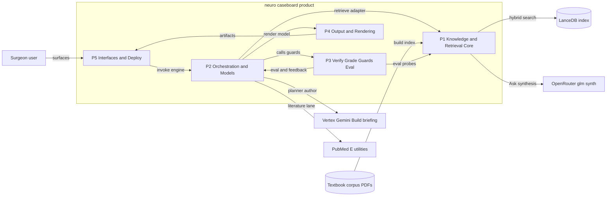
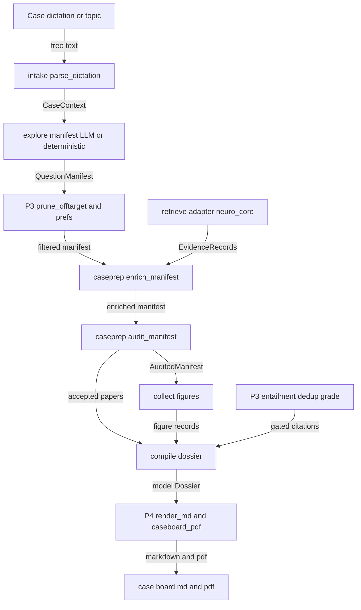
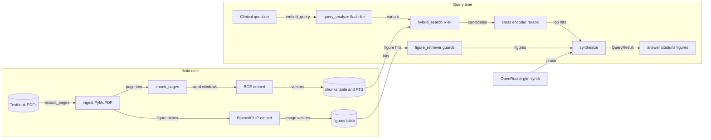
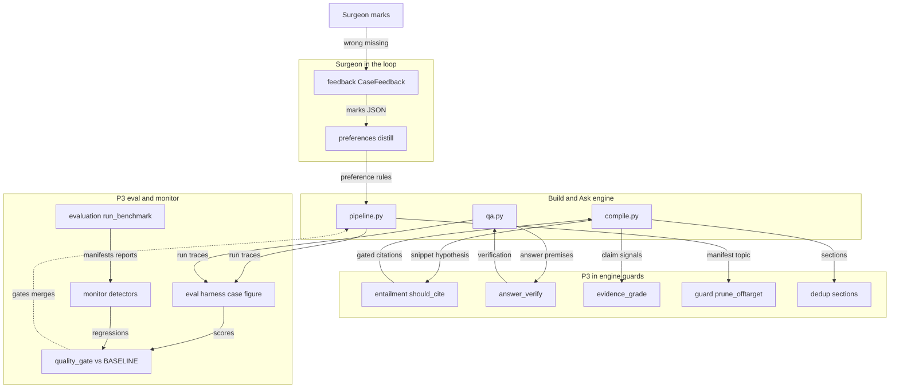
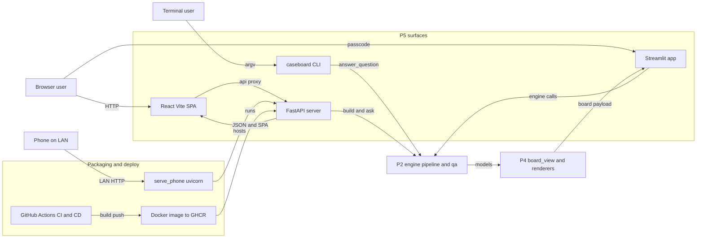
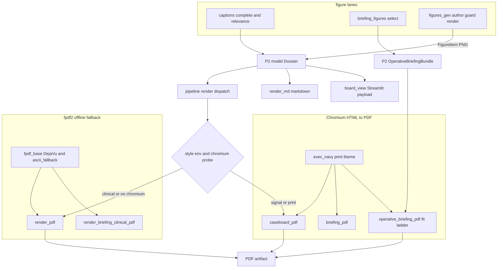

# neuro-caseboard — Architecture & Data-Flow Diagrams

Companion figures to `NEURO_CASEBOARD_ARCHITECTURE.md`. Reflects the `master` branch (synced to `a8b90d9`). Mermaid renders on GitHub.

### Figure 1 — System context and high-level architecture
The five product subsystems (P1–P5) and how they connect to the user surfaces and the external services (the OpenRouter and Vertex Gemini LLMs, the LanceDB index, the textbook corpus, and PubMed).

### Figure 2 — End-to-end case-prep data flow
A Build or Case request from dictation through intake, explore, retrieve, enrich, audit, verify/grade, compile, and render to the final Markdown and PDF artifacts, labeling the object that passes on each hop.

### Figure 3 — Knowledge and retrieval pipeline (neuro_core)
The build-time corpus path (ingest → chunk → embed → index, with a parallel visual/figure lane) and the query-time path (analyze → hybrid retrieve → rerank → synthesize) over the shared LanceDB index.

### Figure 4 — Verification, grading and evaluation loop
The in-engine correctness gates (entailment, answer-verify, evidence-grade, prune, dedup), the offline eval/monitor harness that scores run traces and gates merges, and the surgeon-in-the-loop feedback that distills preferences back into the pipeline.

### Figure 5 — Interfaces and deployment
The four surfaces (CLI, Streamlit, FastAPI, React SPA) all forwarding to the same P2 engine, the P4 presenter they reuse, and the packaging path where Docker and serve_phone host the FastAPI process for browser and phone access.

### Figure 6 — Output and rendering (P4)
How the two P2 models reach shippable artifacts: the dual renderer stacks (Chromium HTML driven by the exec_navy theme, and the offline fpdf2 fallback with guaranteed glyphs), the figure lanes that feed them, and the Markdown / Streamlit presenters. `pipeline` picks the stack by style env plus a Chromium probe.

